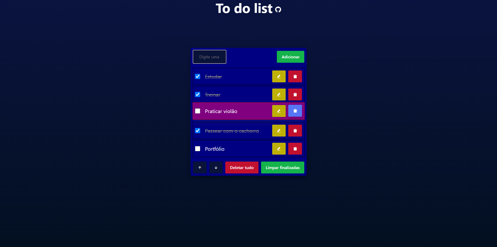
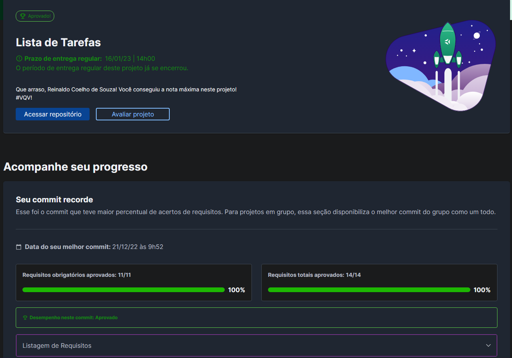

# 📋 To-do list

## 📘 Sobre

To-do list desenvolvida em React.js, TypeScript e Styled Components. Esse projeto foi inicialmente criado com JavaScript vanilla no início dos meus estudos. Decidi refatorar ele colocando em prática alguns conceitos que aprendi estudando Front-end.

Clique [aqui](https://github.com/coelhoreinaldo/to-do-list-vanilla-js) para ver a primeira versão do projeto.

## 🧩 Funcionalidades

- Adicionar tarefas;
- Marcar uma tarefa como concluída;
- Excluir uma ou todas as tarefas;
- Limpar as tarefas finalizadas;
- Editar uma tarefa;
- Mudar uma tarefa de posição.

## ⚛️ Ferramentas

Projeto construído utilizando React.js.

- TypeScript;
- Componentes Funcionais;
- React Hooks;
- Styled Components;
- Mobile First.

## 🛠️ Como executar o projeto?

1. Instalando dependências

`npm install`

2. Executando a aplicação

`npm run dev`

## 📝 Nota

